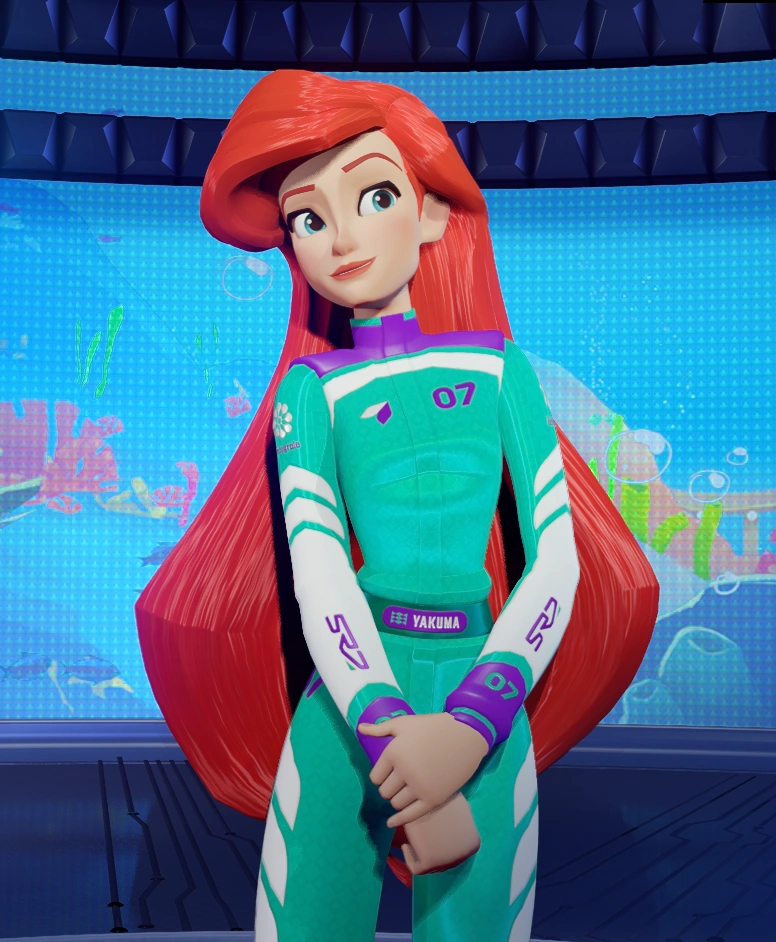
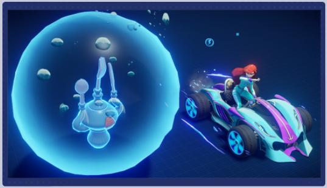
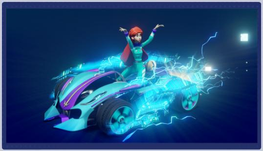
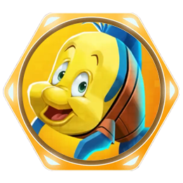
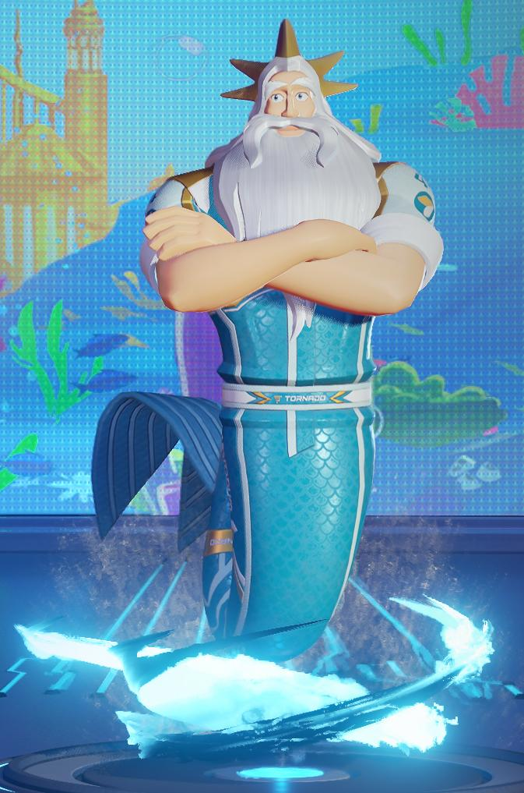
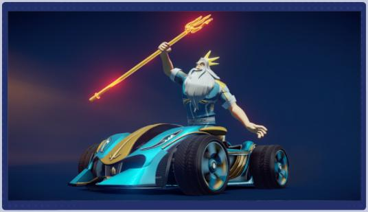
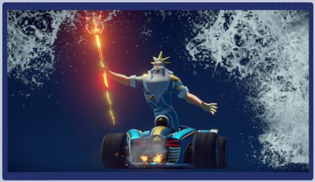

## Arielle

<h4>Klasse: Verteidiger</h4>
<h4>Fähigkeiten:</h4> 
<h5>
- [Relikt-Jägerin](#fähigkeit-relikt-jägerin)
- [Tarnung](../../fähigkeiten/standard/#tarnung)
- [Schuss](../../fähigkeiten/standard/#schuss)
- [Booster](../../fähigkeiten/standard/#booster)
- [Hack](../../fähigkeiten/standard/#hack)
</h5>
<h4>Begleiter: [Fabius](#begleiter-fabius)</h4>

### Fähigkeit: Relikt-Jägerin

Normal

Mehrere Unterwasserrelikte erscheinen auf der Strecke. Arielles Höchstgeschwindigkeit erhöht sich <a style="color: var(--sl-color-text-accent);">**leicht**</a> für jedes gesammelte Relikt.

Aufgeladen

Aktiviere einen Tempo-Booster für einen <a style="color: var(--sl-color-text-accent);">**kurzen**</a> Zeitraum. Überhole andere Fahrer, um den Zeitraum zu verlängern.

Arielles Höchstgeschwindigkeit erhöht sich nun nun <a style="color: var(--sl-color-text-accent);">**moderat**</a>. Der Tempo-Booster hat nun eine <a style="color: var(--sl-color-text-accent);">**moderate**</a> Dauer.

Arielles Höchstgeschwindigkeit erhöht sich nun nun <a style="color: var(--sl-color-text-accent);">**stark**</a>. Der Tempo-Booster hat nun eine <a style="color: var(--sl-color-text-accent);">**lange**</a> Dauer.

Arielles Höchstgeschwindigkeit erhöht sich nun nun <a style="color: var(--sl-color-text-accent);">**sehr stark**</a>. Der Tempo-Booster hat nun eine <a style="color: var(--sl-color-text-accent);">**sehr lange**</a> Dauer.

### Begleiter: Fabius

## König Triton

<h4>Klasse: Raufbold</h4>
<h4>Fähigkeiten:</h4> 
<h5>
- [Tritons Dreizack](#fähigkeit-dreizack)
- [Schuss](../../fähigkeiten/standard/#schuss)
- [Booster](../../fähigkeiten/standard/#booster)
- [Bombe](../../fähigkeiten/standard/#bombe)
- [Schild](../../fähigkeiten/standard/#schild)
</h5>
<h4>Begleiter: [Sebastian](#begleiter-sebastian)</h4>

### Fähigkeit: Dreizack

Normal

König Triton schießt mit seinem Dreizack einen langen Energiestrahl vor sich her, der eine <a style="color: var(--sl-color-text-accent);">**moderate**</a> Zeit anhält. Wenn der Strahl auf einen Gegner gerichtet ist, explodiert er und betäubt alle um ihn herum.

Aufgeladen

König Triton benutzt seinen Dreizack, um eine breite Flut nach hinten zu schicken. Die Flut folgt der Rennstrecke für einen <a style="color: var(--sl-color-text-accent);">**sehr kurzen**</a> Zeitraum.

Energiestrahl hält nun <a style="color: var(--sl-color-text-accent);">**lange**</a> an. Flut hat nun einen <a style="color: var(--sl-color-text-accent);">**kurzen**</a> Zeitraum.

Energiestrahl hält nun <a style="color: var(--sl-color-text-accent);">**sehr lange**</a> an. Flut hat nun einen <a style="color: var(--sl-color-text-accent);">**moderaten**</a> Zeitraum.

Energiestrahl hält nun <a style="color: var(--sl-color-text-accent);">**am längsten**</a> an. Flut hat nun einen <a style="color: var(--sl-color-text-accent);">**langen**</a> Zeitraum.

### Begleiter: Sebastian

