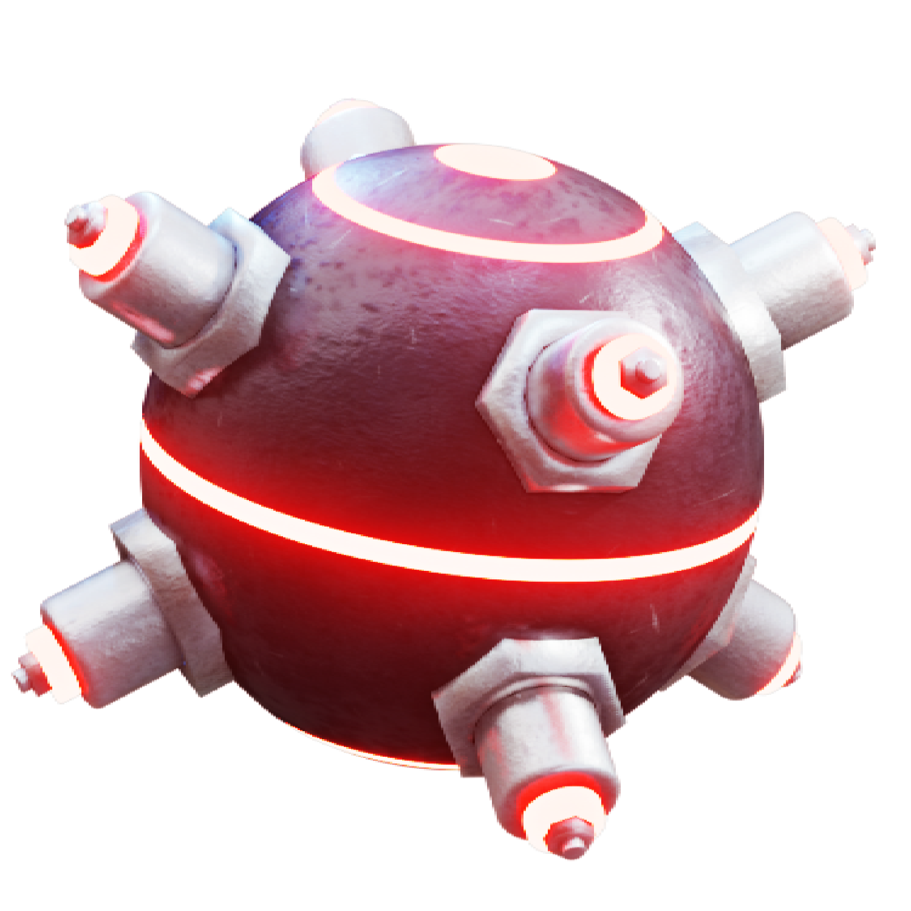
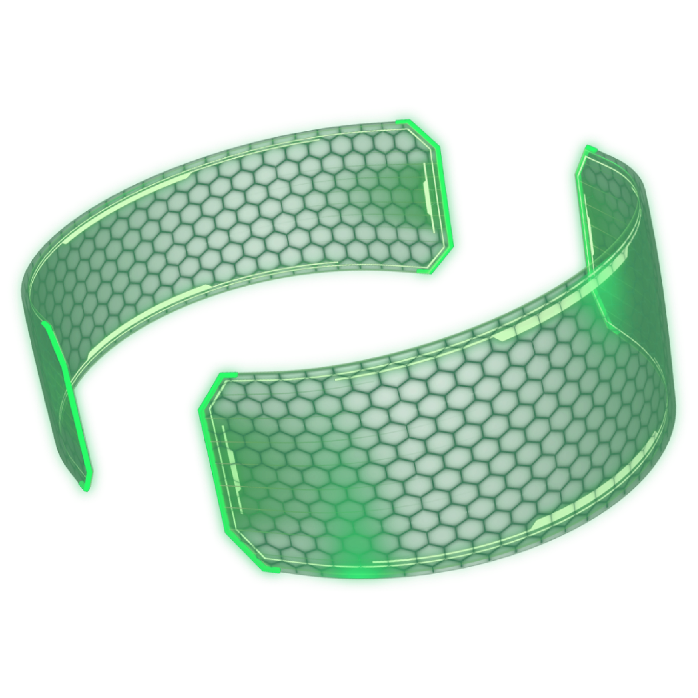

## Bombe

Normal

Drücken, um eine Bombe vor sich zu werfen.

Rückwärts

Rückwärts aktivieren, um die Bombe hinter sich zu werfen.

Aufgeladen

Taste gedrückt halten, um die Bombe weiter zu werfen.

Größere Bombe

Zwei kleine Bomben

Eine große und eine kleine Bombe

Zwei große Bomben

## Booster

Normal

Drücken, um sofort eine mäßige Menge an Nitro-Kraftstoff zu erhalten.

Aufgeladen

Gedrückt halten, um mit der Zeit eine große Menge an Nitro-Kraftstoff zu erhalten.

Eine große oder sehr große Menge an Nitro-Kraftstoff*

Eine sehr große oder eine riesige Menge an Nitro-Kraftstoff*

Eine riesige oder massive Menge an Nitro-Kraftstoff*

Eine riesige oder kolossale Menge an Nitro-Kraftstoff*

*Durch Begleiter kann die jeweilige Menge gesteigert werden.

## Feuer

Normal

Drücken, um eine feurige Aura zu aktivieren.

Rückwärts

Gedrückt halten, um eine große feurige Explosion zu erzeugen.

Aufgeladen

Rückwärts aktivieren, um eine Feuerspur zu erzeugen.

Längere Dauer der Aura und der Spur. Größere Explosion.

Noch längere Dauer der Aura und der Spur. Noch größere Explosion.

Sehr lange Dauer der Aura und der Spur. Sehr große Explosion.

Längste Dauer von Aura und Spur. Maximal große Explosion.

## Hack

Normal

Drücken, um ein schnelles, hüpfendes Projektil abzuschießen, das die Gegner stört (gespiegeltes Bild).

Rückwärts

Rückwärts aktivieren, um eine störende Wand zu erzeugen.

Aufgeladen

Gedrückt halten, um ein sehr langsames, zielsuchendes Geschoss abzuschießen.

Sehr schnelles Projektil. Langsames zielsuchendes Geschoss. Längere Wanddauer.

Superschnelles Projektil. zielsuchendes Geschoss mit durchschnittlicher Geschwindigkeit. Noch längere Wanddauer.

Ultraschnelles Projektil. Geringfügig schnelles zielsuchendes Geschoss. Sehr lange Wanddauer.

Ungelenktes Projektil mit höchster Geschwindigkeit. Schnelles zielsuchendes Geschoss. Längste Dauer der langen Wand.

## Rausch

Normal

Vorwärtssprung über eine überdurchschnittliche Distanz.

Aufgeladen

Gedrückt halten, um drei kleinere Sprünge nach vorne über jeweils eine sehr kurze Distanz auszuführen.

Sprintet eine lange Strecke vorwärts bzw. macht kleinere Sprünge über eine kurze Strecke.

Sprintet für eine längere Strecke vorwärts bzw. macht kleinere Sprünge für jeweils eine moderate Distanz.

Sprintet für eine sehr lange Strecke vorwärts bzw. macht kleinere Sprünge über eine überdurchschnittliche Distanz.

Sprintet vorwärts, um die längste Strecke zurückzulegen bzw. macht kleinere Sprünge, um jeweils eine längere Strecke zurückzulegen.

## Schild

Normal

Drücken, um sich vor einem Treffer zu schützen.

Aufgeladen

Gedrückt halten, um eine Aura zu aktivieren, die einen Gegner betäubt.

Höhere Dauer

Noch höhere Dauer

Sehr hohe Dauer

Höchste Dauer

## Schuss

Normal

Drücken, um ein schnelles, abprallendes Projektil zu werfen.

Rückwärts

Nach hinten drücken, um ein sehr langsames Projektil zu werfen.

Aufgeladen

Gedrückt halten, um ein sehr langsames zielsuchendes Projektil zu werfen.

Sehr schnelles Projektil bzw. langsames rückwärts gerichtetes und zielsuchendes Projektil.

Superschnelles Projektil bzw. rückwärtsgerichtetes, zielsuchendes Projektil mit durchschnittlicher Geschwindigkeit.

Ultraschnelles Projektil bzw. leicht schnelles rückwärtsgerichtetes, zielsuchendes Projektil.

Ein Projektil mit maximaler Geschwindigkeit bzw. ein schnelles rückwärtsgerichtetes zielsuchendes Projektil.

## Tarnung

Normal

Drücken, um für einige Sekunden unsichtbar zu werden.

Aufgeladen

Taste gedrückt halten, um für wenige Sekunden unsichtbar zu werden und danach Feinde in der Nähe zu betäuben.

Längere Unsichtbarkeitsdauer und größere Explosion beim Wiedererscheinen.

Noch längere Dauer der Unsichtbarkeit und noch größere Explosion beim Wiedererscheinen.

Sehr lange Unsichtbarkeitsdauer und eine sehr große Explosion beim Wiedererscheinen.

Längste Unsichtbarkeitsdauer und maximal große Explosion beim Wiedererscheinen.
