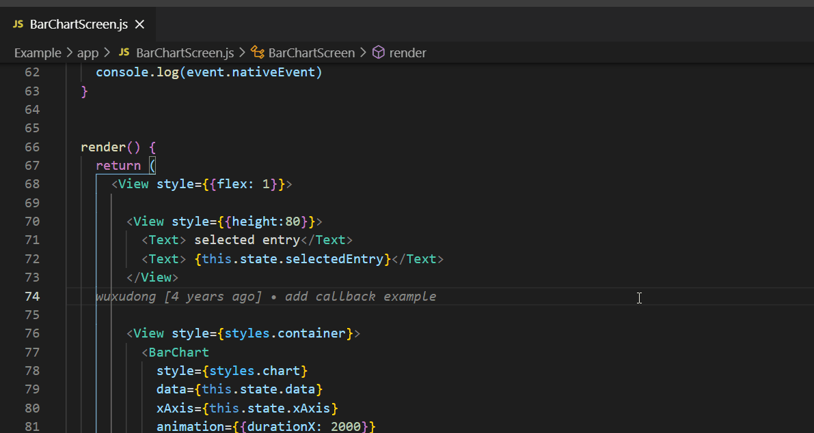
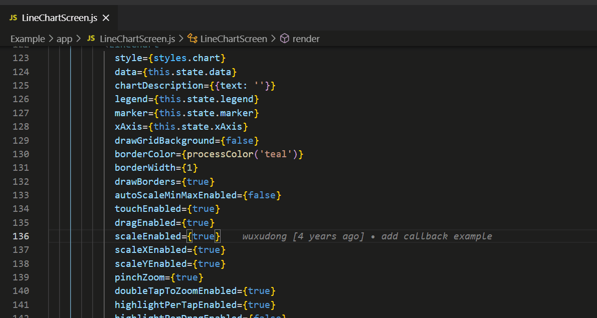
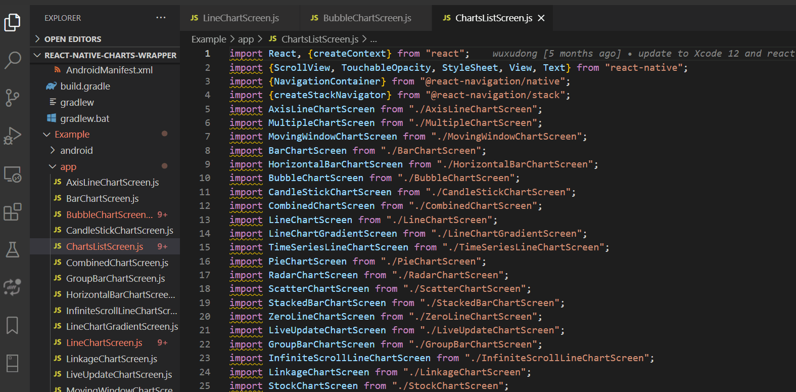
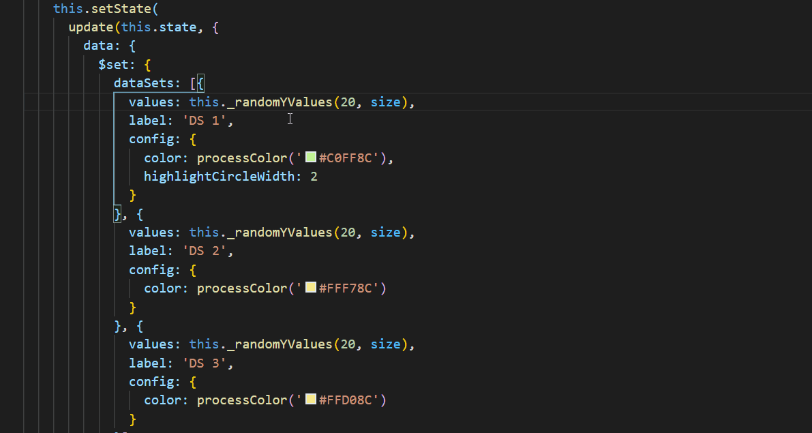
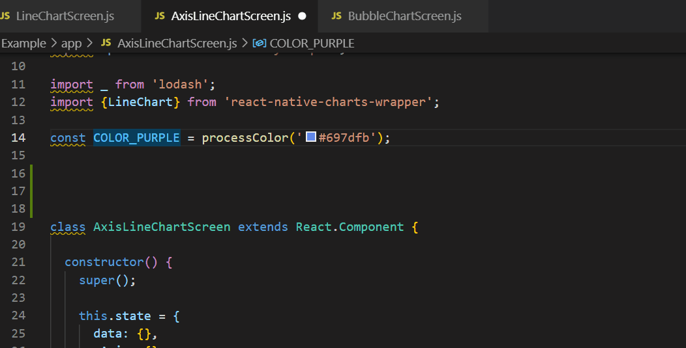
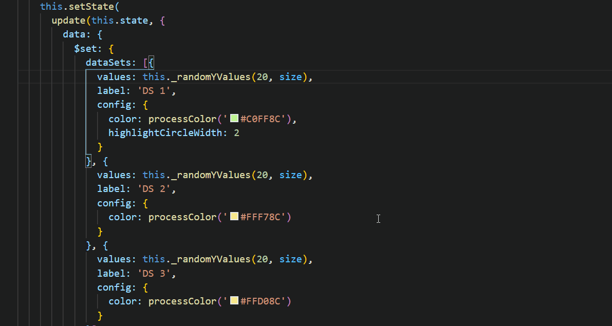
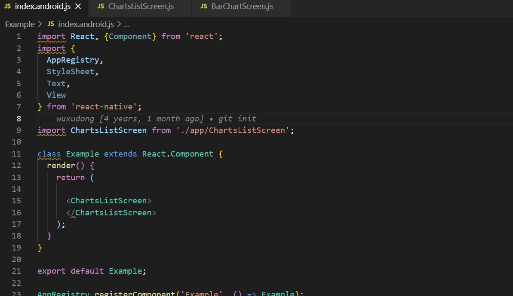
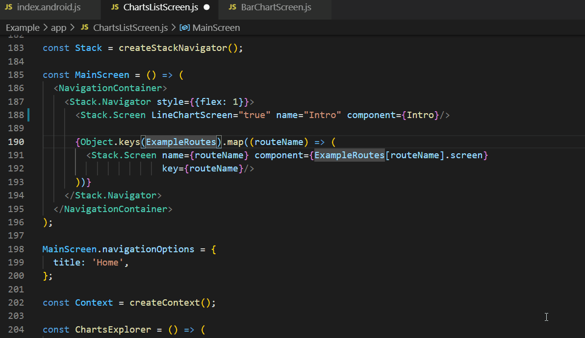
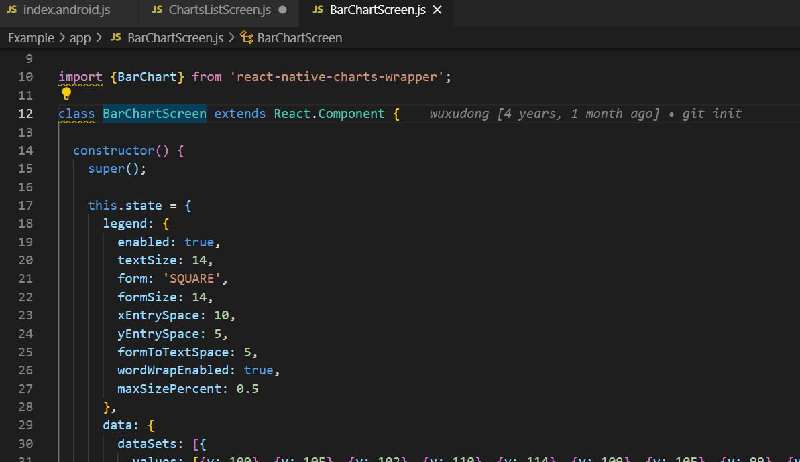
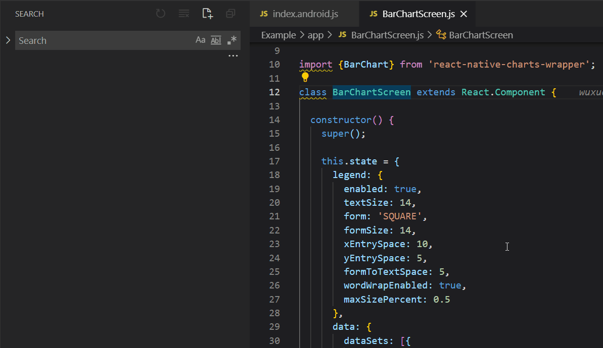

## Shortcuts für Windows und Mac

### Befehlspalette

`Windows: STRG + SHIFT + P`&nbsp;&nbsp;&nbsp;`Mac: CMD + SHIFT + P`

Mit Hilfe einer Befehlspalette kann man je nach aktuellem Kontext auf Befehle zugreifen. 
Man braucht nur ein Schlüsselwort einzugeben, das mit dem Befehl zusammenhängt, und schon findet man ihn, statt sich von Menü zu Menü zu hangeln.
Hier sind die für jeden Befehl relevanten Tastenkombinationen.

Beispiel ansehen

### Schnell öffnen

`Windows: STRG + P`&nbsp;&nbsp;&nbsp;`Mac: CMD + P`

Mit Hilfe dieser Visual Studio Code-Verknüpfung kann man Dateien schnell öffnen. Man muss nur die Pfeiltasten nach unten und oben auf der Tastatur 
verwenden, um die Datei zu finden, die man öffnen möchte. Wenn man sie gefunden hat, drückt man die rechte Pfeiltaste. Auf diese Weise kann man die 
ausgewählte Datei öffnen, die dann im Hintergrund läuft, während man weiterhin neue Dateien öffnen kann.

Beispiel ansehen

### Seitenleiste umklappen

`Windows: STRG + B`&nbsp;&nbsp;&nbsp;`Mac: CMD + B`

Manchmal möchte man beim Schreiben des Codes die volle Breite des Editors nutzen. Mit dieser Tastenkombination kann man die Seitenleiste schnell ein- oder ausblenden. 
Dadurch steht die volle Breite des Editors zur Verfügung.

Beispiel ansehen

### Multi-Select Cursor

`Windows: STRG + D`&nbsp;&nbsp;&nbsp;`Mac: CMD + D`

Man kann mehrere gleiche Snippets auswählen und sie auf einmal ändern.
Für diesen Visual Studio Code-Shortcut muss man ein Snippet auswählen und den Shortcut verwenden. 
Dadurch wird jedes identische Snippet gefunden und man erhält einen aktiven Cursor für weitere Aktionen.

Beispiel ansehen

### Zeile kopieren

`Windows: SHIFT + ALT + UP or SHIFT + ALT + DOWN`&nbsp;&nbsp;&nbsp;`Mac: OPT + SHIFT + UP or OPT + SHIFT + DOWN`

Bei der Softwareentwicklung kommt es häufig vor, dass Programmierer Zeilen kopieren und an anderer Stelle im Projekt einfügen. 
an anderer Stelle in das Projekt einfügen. Danach werden kleine Details in den Zeilen geändert. Dies geschieht 
so häufig, dass man für das schnelle Kopieren/Einfügen sogar ein Tastenkürzel verwenden kann.

Beispiel ansehen

### Code-Block kommentieren

`Windows: SHIFT + ALT + A or STRG + #`&nbsp;&nbsp;&nbsp;`Mac: SHIFT + OPT + A`

Ob man nun mit einer Codeänderung experimentieren oder einen Fehler verfolgen möchte: 
Die Kommentierung von Codeblöcken ist eine Notwendigkeit. Es wird sogar häufig gemacht. 
Mit den oben genannten Abkürzungen kann man bei dieser Tätigkeit Zeit sparen.

Beispiel ansehen

### Alle Symbole anzeigen

`Windows: STRG + T`&nbsp;&nbsp;&nbsp;`Mac: CMD + T`

Wenn man alle Symbole, d. h. Funktionen, Klassen, Dateien usw. auf einen Blick sehen möchte, verwendet man die oben genannten Tastenkombinationen. 
Damit öffnet man eine Referenzansicht, die alle identischen Symbole anzeigt. Diese Verknüpfung ähnelt einer globalen Suche, arbeitet aber 
mit den Symbolen. Dies ist eine der nützlichsten Abkürzungen beim Durchsuchen des Codes.

Beispiel ansehen

### Trigger-Vorschlag und Trigger-Parameter-Hinweise

`Windows: STRG + Space, STRG + SHIFT + SPACE`&nbsp;&nbsp;&nbsp;`Mac: CMD + Space, CMD + SHIFT + SPACE`

Trigger-Vorschläge und Parameter-Hinweise sind nützlich, wenn man mit Visual Studio Code arbeitet. Allerdings 
kann dies jedoch oft frustrierend sein, da das Vorschlagsfeld die vorherige Codezeile abdeckt. Eine einfache Möglichkeit ist 
Trigger-Vorschläge und Trigger-Parameter-Hinweise mit Hilfe von Tastaturkürzeln schnell ein- und auszublenden.

Beispiel ansehen

Trigger-Vorschlag

Trigger-Parameter-Hinweise

### Referenzen anzeigen

`Windows: SHIFT + F12`&nbsp;&nbsp;&nbsp;`Mac: SHIFT + F12`

Während eines Kontextwechsels muss man Dinge überprüfen. Hier kann man Referenzen über die oben genannte Tastenkombination erhalten. 
Man kann verschiedene Referenzen schnell überprüfen und Änderungen an ihnen vornehmen. 

Beispiel ansehen

### Globale Suche

`Windows: STRG + SHIFT + F`&nbsp;&nbsp;&nbsp;`Mac: CMD + SHIFT + F`

Globale Suche über die Seitenleiste.

Beispiel ansehen

### Datei suchen

`Windows: STRG + P`

Suche nach einer beliebige Datei oder einem Symbol, indem man seinen Namen eingibt.

### Zuletzt verwendete Dateien

`Windows: STRG + TAB`

Man kann hiermit ähnlich der Ansicht "geöffnete Editoren" alle offenen Dateien durchschalten.

### Editor-Befehle

`Windows: STRG + SHIFT + P`

Durchsuche alle Befehle von VSCode.

### Zum Symbol einer Datei navigieren

`Windows: STRG + SHIFT + O`

Navigieren Sie zu einem bestimmten Symbol in der aktuellen Datei.